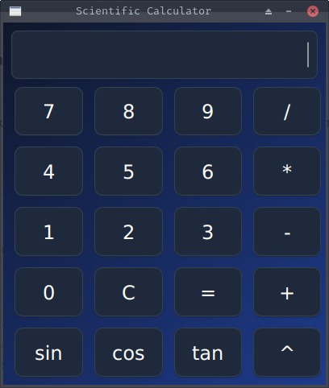

# Scientific Calculator

A simple scientific calculator built with **JavaFX**.  
Supports basic arithmetic operations and scientific functions like `sin`, `cos`, and `tan`.

---

## 🖼️ Preview



---

## 💡 Features

- Responsive button layout
- Dark blue gradient theme
- Functional buttons: +, -, *, /, =, C
- Scientific functions: sin, cos, tan, power (^)
- Auto-comma formatting (e.g. 1,000)

---

## 🚀 How to Run

1. Clone the repository  
   ```bash
   git clone https://github.com/your-username/your-repo-name.git
   cd your-repo-name
``

